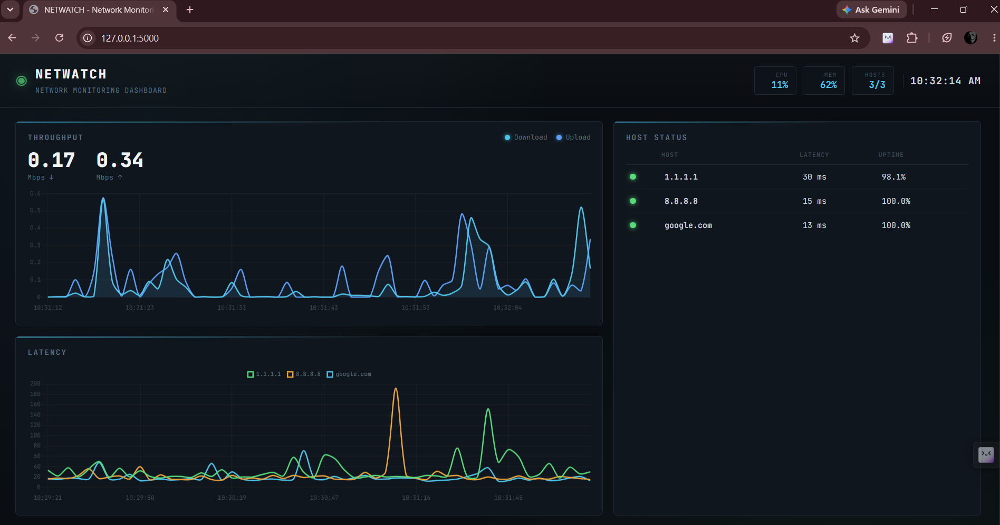

# 🖥️ NETWATCH — Network Monitoring Dashboard

A self-hosted, real-time network monitoring dashboard built with **Python, Flask, JavaScript, and Chart.js**.

NETWATCH monitors network connectivity, host availability, latency, bandwidth throughput, CPU/memory usage, and network events through a live web dashboard.


---

## 📸 Dashboard Preview



> Real-time monitoring dashboard showing network throughput, host availability, latency, system resources, and monitoring events.

---

## 🚀 Features

- 📡 Real-time network monitoring
- 📊 Live download/upload bandwidth monitoring
- ⚡ Per-host latency monitoring
- 🟢 Host availability and uptime tracking
- 💻 CPU utilization monitoring
- 🧠 Memory utilization monitoring
- 📈 Live bandwidth charts
- 📉 Per-host latency charts
- 📝 Network event logging
- 🔄 Automatic dashboard updates every 3 seconds
- 🌐 REST API for monitoring data
- 🖥️ Cross-platform ping support
- 💾 No database required
- 🔒 Runs locally on your machine

---

## 🧠 Networking Concepts Demonstrated

This project demonstrates practical knowledge of:

- **IP Addresses**
- **ICMP / Ping**
- **Network Latency**
- **Host Availability**
- **Uptime Monitoring**
- **Network Throughput**
- **Download / Upload Bandwidth**
- **DNS / Hostname Resolution**
- **Client-Server Architecture**
- **REST API**
- **JSON Data Communication**
- **Network Status Monitoring**
- **System Network Interface Statistics**

---

## 🛠️ Technology Stack

### Backend

- Python
- Flask
- psutil
- REST API

### Frontend

- HTML5
- CSS3
- Vanilla JavaScript
- Chart.js

### Monitoring

- ICMP / system ping
- Network interface statistics
- CPU and memory monitoring

---

## ⚙️ How It Works

NETWATCH consists of three main components:

### 1. Network Monitor

A background monitoring process checks configured hosts and measures:

- Host availability
- Ping latency
- Uptime percentage
- Status changes

### 2. Bandwidth Monitor

The application uses `psutil.net_io_counters()` to monitor network interface traffic.

It calculates:

- Download throughput
- Upload throughput

based on changes in transmitted and received bytes over time.

### 3. Web Dashboard

The frontend requests monitoring data from:

```text
GET /api/summary
